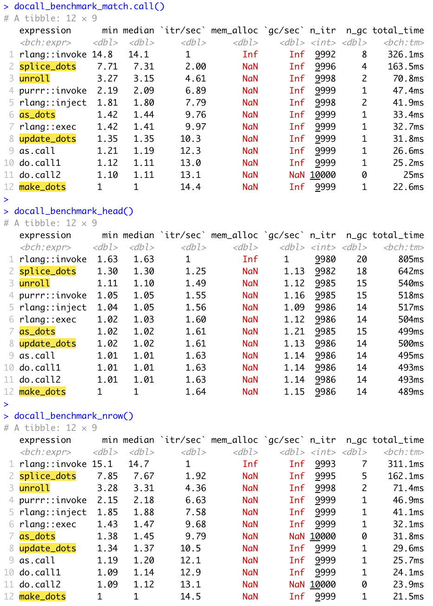

<!-- README.md is generated from README.Rmd. Please edit that file -->

# docalltest

exploring alternatives to do.call()

We showcase a few functions that can be used instead of `do.call()`,
taking as a base the examples in this article:
<https://rpubs.com/hadley/do-call2>.

In this order:

-   We show the syntax
-   We provide the definitions
-   We compare performance
-   We compare error and trace
-   We talk about CRAN and takeaways
-   We propose a way to expand dots in a given function so we can call

``` r
library(docalltest)
f <- function(...) {
  expand_dots()
  subset(...)
}
# just as before
f(cars, speed == 4)
#>   speed dist
#> 1     4    2
#> 2     4   10
# but now  we can also do this
f(... = alist(cars, speed == 4))
#>   speed dist
#> 1     4    2
#> 2     4   10
```

## syntax

Those are equivalent

``` r
# tidyverse
f_invoke1 <- function(...) rlang::invoke(g, list(diamonds))
f_invoke2 <- function(...) purrr::invoke(g, list(diamonds))
f_inject <- function(...) rlang::inject(g(!!!list(diamonds)))
f_exec <- function(...) rlang::exec(g, !!!list(diamonds))

# base
f_as.call <- function(...) eval_bare(as.call(c(quote(g), list(diamonds))))
f_do.call1 <- function(...) do.call(g, list(diamonds))
f_do.call2 <- function(...) do.call("g", list(diamonds))

# from this package 
f_unroll <- function(...) unroll(g(... = list(diamonds)))
f_update_dots <- function(...) {update_dots(diamonds) ; g(...)}
f_as_dots <- function(...) {`...` <- as_dots(list(diamonds)) ; g(...)}
f_make_dots <- function(...) {`...` <- make_dots(diamonds) ; g(...)}
f_splice_dots <- function(...) splice_dots(g(..(alist(diamonds))))
```

## code

``` r
make_dots <- function(...) environment()$...

update_dots <- function(...) {
  assign("...", environment()$..., parent.frame())
}

as_dots <- function(x) {
  do.call(function(...) environment()$..., x)
}

unroll <- function(call) {
  call <- substitute(call)
  dots <- call[["..."]]
  i <- which(names(call) == "...")
  if (length(i) != 1) stop("A named `...` arg is expected once and only once")
  call1 <- as.list(call)[1:(i-1)]
  call2 <- eval.parent(call[["..."]])
  l <- length(call)
  call3 <- if (i < l) as.list(call)[(i+1):l]
  new_call <- as.call(c(call1, call2, call3))
  eval_bare(new_call, parent.frame())
}

splice_dots <- function(call) {
  eval_bare(eval_bare(substitute(bquote(call, splice = TRUE))), parent.frame())
}
```

## performance

We measure their performance using 3 different functions for `g` :

-   `g <- function(...) match.call()`
-   `g <- head`
-   `g <- nrow`



## errors and traceback

### base

``` r
g <- function(...) stop(...)

f_do.call1 <- function(...) do.call(g, list("an ", "error"))
f_do.call1()
#> Error in (function (...) : an error
traceback()
#> 4: stop(...) at #1
#> 3: (function (...) 
#>    stop(...))("an ", "error")
#> 2: do.call(g, list("an ", "error")) at #2
#> 1: f_do.call()

f_do.call2 <- function(...) do.call("g", list("an ", "error"))
f_do.call2()
#> Error in g("an ", "error") : an error
traceback()
#> 4: stop(...) at #1
#> 3: g("an ", "error")
#> 2: do.call("g", list("an ", "error")) at #2
#> 1: f_do.call2()

f_as.call <- function(...) eval_bare(as.call(c(quote(g), list("an ", "error"))))
f_as.call()
#> Error in g("an ", "error") : an error
traceback()
#> 4: stop(...) at #1
#> 3: g("an ", "error")
#> 2: eval_bare(as.call(c(quote(g), list("an ", "error")))) at #2
#> 1: f_as.call()
```

### tidyverse

``` r
f_invoke1 <- function(...) rlang::invoke(g, list("an ", "error"))
f_invoke1()
#> Error in .fn(`1`, `2`) : an error
traceback()
#> 4: stop(...) at #1
#> 3: .fn(`1`, `2`)
#> 2: rlang::invoke(g, list("an ", "error")) at #1
#> 1: f_invoke1()

f_invoke2 <- function(...) purrr::invoke(g, list("an ", "error"))
f_invoke2()
#> Error in (function (...)  : an error
traceback()
#> 5: stop(...) at #1
#> 4: (function (...) 
#>    stop(...))("an ", "error")
#> 3: do.call(.f, args, envir = .env)
#> 2: purrr::invoke(g, list("an ", "error")) at #1
#> 1: f_invoke2()

f_inject <- function(...) rlang::inject(g(!!!list("an ", "error")))
f_inject()
#> Error in g("an ", "error") : an error
traceback()
#> 4: stop(...) at #1
#> 3: g("an ", "error")
#> 2: rlang::inject(g(!!!list("an ", "error"))) at #1
#> 1: f_inject()

f_exec <- function(...) rlang::exec(g, !!!list("an ", "error"))
f_exec()
#> Error in (function (...)  : an error
traceback()
#> 4: stop(...) at #1
#> 3: (function (...) 
#>    stop(...))("an ", "error")
#> 2: rlang::exec(g, !!!list("an ", "error")) at #1
#> 1: f_exec()
```

### in this package

``` r
f_unroll <- function(...) {
  unroll(g(... = list("an ", "error")))
}
f_unroll()
#> Error in g("an ", "error"): an error
traceback()
#> 5: stop(...) at #1
#> 4: g("an ", "error")
#> 3: eval_bare(new_call, parent.frame()) at main.R#29
#> 2: unroll(g(... = list("an ", "error"))) at #2
#> 1: f_unroll()

f_update_dots <- function(...) {
  update_dots("an ", "error")
  g(...)
}
f_update_dots()
#> Error in g(...) : an error
traceback()
#> 3: stop(...) at #1
#> 2: g(...) at #3
#> 1: f_update_dots()

f_as_dots <- function(...) {
  `...` <- as_dots(list("an ", "error"))
  g(...)
}
f_as_dots()
#> Error in g(...) : an error
traceback()
#> 3: stop(...) at #1
#> 2: g(...) at #3
#> 1: f_as_dots()

f_make_dots <- function(...) {
  `...` <- make_dots("an ", "error")
  g(...)
}
f_make_dots()
#> Error in g(...) : an error
traceback()
#> 3: stop(...) at #1
#> 2: g(...) at #3
#> 1: f_make_dots()

f_splice_dots <- function(...) {
  splice_dots(g(..(alist("an ", "error"))))
}
f_splice_dots()
#> Error in g("an ", "error"): an error
traceback()
#> 5: stop(...) at #1
#> 4: g("an ", "error")
#> 3: eval_bare(eval_bare(substitute(bquote(call, splice = TRUE))), 
#>        parent.frame()) at main.R#20
#> 2: splice_dots(g(..(alist("an ", "error")))) at #2
#> 1: f_splice_dots()
```

## expanding dots

if we are writing a function, we can make it flexible so we can pass the
dots with `... =`, it comes at a rather small performance cost

``` r
f1 <- function(...) {
  subset(...)
}

f2 <- function(...) {
  expand_dots()
  subset(...)
}

bench::mark(
  f1(cars, speed == 4),
  f2(cars, speed == 4),
  f2(... = alist(cars, speed == 4)),
  do.call("f1", alist(cars, speed == 4)),
)
#> # A tibble: 4 × 6
#>   expression                                  min median itr/s…¹ mem_a…² gc/se…³
#>   <bch:expr>                             <bch:tm> <bch:>   <dbl> <bch:b>   <dbl>
#> 1 f1(cars, speed == 4)                     19.4µs 20.9µs  45632.  1.72KB    64.0
#> 2 f2(cars, speed == 4)                     22.3µs 24.1µs  39255.  1.72KB    62.9
#> 3 f2(... = alist(cars, speed == 4))        26.1µs 28.5µs  32887.  9.49KB    65.9
#> 4 do.call("f1", alist(cars, speed == 4))   21.6µs 23.2µs  40737.  7.67KB    65.3
#> # … with abbreviated variable names ¹​`itr/sec`, ²​mem_alloc, ³​`gc/sec`
```

## too weird for CRAN ?

-   These functions themselves could be on CRAN as far as checks go.
-   Functions built with `as_dots()` and `make_dots()` will give a
    warning during checks though
-   `update_dots()` gives a warning only if used in a function that
    doesn’t have `...` args
-   `unroll()` is not problematic, albeit a bit slow
-   `expand_dots()` is not problematic

## takeaways

-   `do.call()` called on a string and `rlang::inject()` give the best
    traces
-   We can be even faster than `do.call()`, but the syntax will be
    surprising and the functions created this way cannot be packaged on
    CRAN
-   We can build a base R equivalent of `rlang::inject()` using
    `bquote()` but it’s a bit slower
-   Altermatives are all in the same ballpark performance wise
